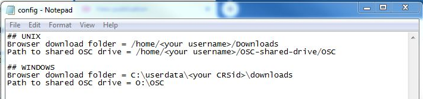

## OASIS (Open Access Service Invoice Stamper)

OASIS is OATs' flagship utility. It can be used to digitally stamp and file PDFs of invoices sent to the OA helpdesk. To run OASIS on Windows, 

* Open the Windows program "Command prompt"
* Issue the following command on the Command prompt window: `C:\Applications\<WinPython folder>\<python version folder>\python.exe %USERPROFILE%\OATs-master\oasis.py`, replacing <WinPython folder>\<python version folder> with the correct path in your machine. See the [troubleshooting](#specifying-the-correct-path) section below for more details if you encounter problems here. TIP: To paste from your clipboard into the command prompt window, right-click on it and select "paste". 

If you are a UNIX user (Linux, Mac OS), issue these commands in your terminal:

```
$ cd <path to OATS folder>
$ ./oasis.py
```

The first time it runs, the program will create a configuration file `~/.OATs/OASIS/config.txt` and will open it in a text editor window (Notepad on Windows; your default text editor on UNIX). It will look somewhat like this:



Please edit this file to provide:

* the full path of your browser download folder (i.e. the folder where OASIS will be able to find invoices you have just downloaded)
* the full path to the shared OSC drive (this path can be different from the default if you are using the library's VPN, etc; please check). 

If you are working on Windows, just delete the first three lines related to UNIX. Check both paths carefully (using the Windows Explorer search bar just like you did previously when [setting the python path](#specifying-the-correct-path)) and replace them if necessary.

Please remember to save the text file after editing it.

If, for any reason, you need to reconfigure OASIS to save invoices somewhere else, you may edit `C:\Users\<<your CRSid>>\.OATs\OASIS\config.txt` using your favorite plain text editor (e.g. Notepad++).

Congratulations! OASIS should now be ready to process your first invoice. 

### Usage

[This short video](https://sms.cam.ac.uk/media/3075499) demonstrates OASIS typical usage. The steps to follow in a Windows machine are:

* Download the invoice (if your browser is not configured to automatically save PDF files, you will need to save the invoice file to the folder you configured above). OASIS assumes that the last PDF you download is the invoice you intend to process, so make sure the invoice is the last file you downloaded before proceeding to the next step.  
* Navigate to the submission ticket in Zendesk (the one with a decision on the manuscript; usually starting with SE-)
* Fill in the relevant details in Zendesk (funding codes, invoice number, invoice date, etc)
* Apply Zendesk macro "Export invoice data (OASIS)" (but do not save the ticket)
* Summon OASIS by:
    * If this is the first invoice you are processing today:
        * From the Zendesk macro output, copy the line that is just below the tag %%YOUR NAME (this is your python path; see [troubleshooting](#troubleshooting) below for details)
        * Opening program "Command prompt"
        * Pasting and hiting "Enter/Return" (the shortcut Ctrl+V does not work in the command prompt, so you will need to right click the prompt and select "paste")
        * Leave the command prompt window to facilitate processing subsequent invoices
    * If you have already processed an invoice today (and left command prompt running):
        *  Press the up arrow key (↑) on your keyboard, followed by "Enter/Return"  

* Follow the instructions on the command prompt window, which will involve:
    * Selecting and copying all the text of the internal note that was produced in Zendesk (Ctrl+A, Ctrl+C)
    * Pasting that text into invoice-variables.txt and saving that file (Ctrl+V, Ctrl+S)
    * Using TeXworks to stamp the invoice (click on the green and triangular "play" button near the top left corner of the TeXworks window; please close the two windows of TexWorks once you have done this)
    * Confirming that you are happy with the result (by typing "y" and pressing Enter on the command prompt window)

* Either delete the text produced in Zendesk by the OASIS macro or replace it with a reference to the ticket containing the original invoice.
    
OASIS will perform the following actions automatically:

* move the stamped invoice to the print folder on the shared drive \\OSC\PaymentsAndCommitments\Invoices\Invoices_to_print
* file a copy of the invoice in the archive folder on the shared drive \\OSC\PaymentsAndCommitments\Invoices\Invoices to be checked

Regularly send all invoices in the print folder to the printer and move then to "Printed_just_now" subfolder. Once you have confirmed that all invoices were printed correctly:
 * please delete the contents of the "Printed_just_now" subfolder
 * place the printed invoices in the bottom tray of the black 3-compartments organiser labelled "INVOICES for Danny"

#### Moving the stamp

You can adjust the position of the electronic stamp produced by OASIS by changing the following two lines of the output produced by the OASIS Zendesk macro:

```
\newcommand{\xshift}{-7.5}
\newcommand{\yshift}{-4}
``` 

xshift and yshift control, respectively, the horizontal and vertical position of the stamp. The numeric value is in centimetres. Thus, to move the stamp down by 2 centimetres you would need to change the value of yshift from -4 to -6, as shown below:

```
\newcommand{\xshift}{-7.5}
\newcommand{\yshift}{-6}
```

The valid ranges of values for these two parameters are:

* xshift: -10 (left margin) to -5 (right margin)  
* yshift: -15.5 (bottom of page) to 12.5 (top of page)


#### Processing two separate invoices associated with the same Zendesk ticket

Say you received two invoices for the same journal article, one for Open Access charges and one for colour charges. In this case, when processing the second invoice, you will need to explicitly tell OASIS what type of invoice you intend to process. To do this, simply set the value of the drop-down form field "OASIS type" in Zendesk to match the invoice type, and then follow the basic [usage](#usage) instructions. 


#### Processing invoices for *both* Open Access and other publication charges

[This short video](https://sms.cam.ac.uk/media/3076552) demonstrates the workflow for processing invoices for both Open Access and other publication charges. The process is very similar to [typical usage](#usage), but the following additional steps are required:

* In Zendesk, you will need to select the value "APC + page/colour" for drop-down form field "OASIS type" before activating the OASIS macro.
* You will need to edit the output of the macro to indicate how much should be charged to each transaction code. To do this, look for the "FUND SPLIT" block of the macro output and replace the following placemarkers as appropriate:
    * "Enter page charges here": replace this with the value charged for page and colour charges.
    * "Enter RCUK apc amount amount here": replace this with the amount of the APC that will be charged to RCUK 
    * "Enter COAF apc amount amount here": replace this with the amount of the APC that will be charged to COAF

```
%%%%FUND SPLIT
\newcommand{\RCUKratio}{\mbox{\begin{tabular}{ll}(Enter page charges here) \\ (Enter RCUK apc amount amount here)\end{tabular}}} \newcommand{\COAFratio}{(Enter COAF apc amount here)}
```
 

### Adding support for a new grant code

To add support for new grant codes, edit the block "RCUK COST CENTRE AND SOURCE OF FUNDS" if you intend to add a new UKRI grant code, or the block "COAF COST CENTRE AND SOURCE OF FUNDS" of the [OASIS Zendesk macro](../pdfapps/oasis/zd-macro.txt).

Those blocks will contain if else statements defining what OASIS should print for each Zendesk tag associated with dropdown fields "RCUK cost centre" and "COAF cost centre". For example: 

```
{\VEJEJUDB\transaction}
{\VEJIJUDB\transaction}
{\VEJFJUDB\transaction}
{\VEJJJUDB\transaction}
{\VEJKJUDB\transaction}
{\RCUKeighteen\transaction}
{\RCUKnineteen\transaction}
{\ERROR{RCUK cost centre not recognized}}
``` 

To add a new grant code to the block above, one would need to add a line (before the final else statement) in the format:  

```
{<NEW GRANT CODE>\transaction}
```


### Troubleshooting

#### Specifying the correct path

If when attempting to run OASIS you encounter error message "The system cannot find the path specified", this means that WinPython is not installed in the location (the "path") we expected it to be (i.e. "C:\Applications\Wpy [...] \python.exe"). To fix this, search for the installed python application (file python.exe) through Windows Explorer (clicking "Local disk C:", then "Applications"; then "WinPython" folder. When this is done, click on the search bar at the top of Windows Explorer and copy paste the line that appears. Add “\python.exe” at the end and this gives you the "path" to that file. Send this full path to one of your coleagues who is responsible for updating Zendesk Macros.

Your colleague should then update the [OASIS Zendesk macro](../pdfapps/oasis/zd-macro.txt) to include, near the end of the file, your personal path, written as follows leave the % signs as they are):

```
%% YOUR FIRST NAME
% [copy/paste the python path here without brackets] %USERPROFILE%\OATS-master\oasis.py
```

#### Making sure invoice-variables.txt is encoded as UTF-8

If, like the author of OASIS, your name contains accented characters, please ensure that file invoice-variables.txt is encoded as UTF-8. Else, you will probably run into a nasty error when attempting to stamp the invoice using TexWorks: 

```! Package inputenc Error: Invalid UTF-8 byte sequence.```

Notepad++ displays the encoding of a file on the bottom right corner of its windows. If it says anything other than UTF-8 (e.g. ANSI) when invoice-variables.txt is opened, please follow these steps to change the encoding of this file to UTF-8:
* On the top menu, click "Encoding"
* Click "encode in UTF-8"
* Save the file
